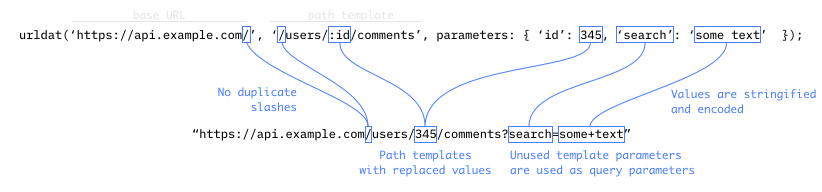

Convenient URL builder



## Description

This library is inspired by Javascript package [urlcat](https://www.npmjs.com/package/urlcat).
It's a loose port with slightly different API.

Library exposes simple `urldat` function that helps you build URLs effectively
while avoiding typical mis-steps, like double slashes or unencoded values.

## Features

* Friendly API
* No dependencies, uses core Dart library
* Simple source code, easy to fork
* `urldatFactory` for creating closures with pre-configured base URL

## Usage

A simple usage example:

```dart
import 'package:urldat/urldat.dart';
import 'package:http/http.dart' as http;

main() {
  final url = urldat(
    'https://example.com/',
    '/path/:id',
    parameters: { 'id': 100, 'q': 'search', 't': DateTime.now() });

  http.get(url);
}
```

## Feature requests and bugs

Please file feature requests and bugs at the [issue tracker][tracker].

[tracker]: https://github.com/comatory/urldat/issues
